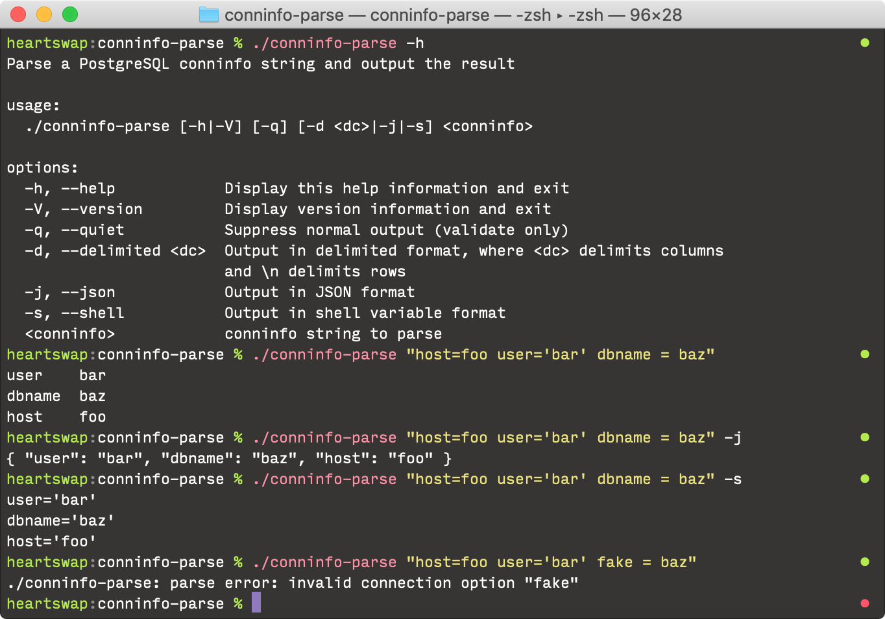

# conninfo-parse

`conninfo-parse` is a small and rather niche utility which accepts a PostgreSQL
[`conninfo` (DSN) string](https://www.postgresql.org/docs/11/libpq-connect.html#LIBPQ-CONNSTRING),
parses it, and prints the result in one of several formats.

## Usage

`conninfo-parse` supports three output formats:

* **Delimited** —
  Key/value pairs are printed one pair per line, with each key and value
  separated by an arbitrary delimiter string. This is the default behaviour; the
  default delimiter is a tab character.
* **JSON** —
  Key/value pairs are printed as members of a JSON object. (Where available.)
* **Shell** —
  Similar to the delimited format, except that key/value pairs are valid shell
  variable assignments. This is designed to be used safely with the shell's
  `eval` built-in.

## Building

Given how niche this tool is, i feel pretty lazy about the build requirements;
i haven't put in any effort to make it extremely portable, &c. As such, you'll
need the following to build:

* GCC or Clang
* bash or zsh for `configure`
* GNU `make`
* `pkg-config`
* `json-c` headers (optional — needed for JSON output)
* `libpq` headers

On Debian/Ubuntu you can install the headers via
`sudo apt-get install libpq-dev libjson0-dev`.

On macOS, `brew install postgresql json-c` will install the correct headers for
you.

Once you have the necessary prerequisites, simply run `./configure && make` to
build.

## Licence

MIT.
